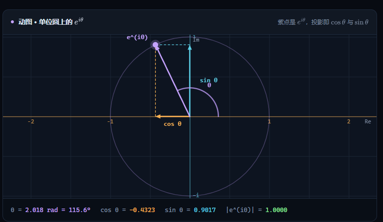
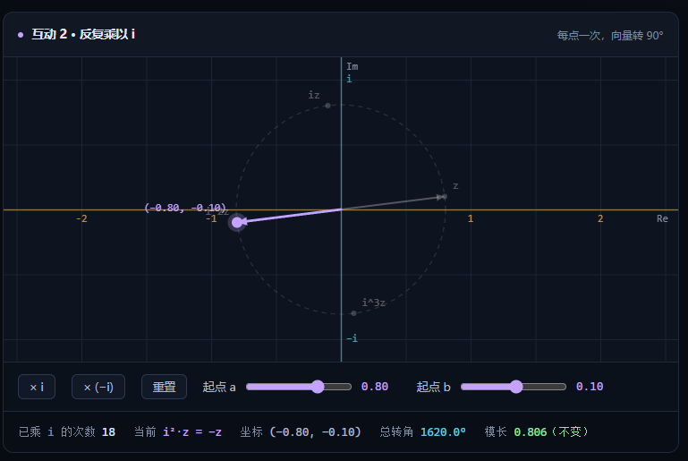
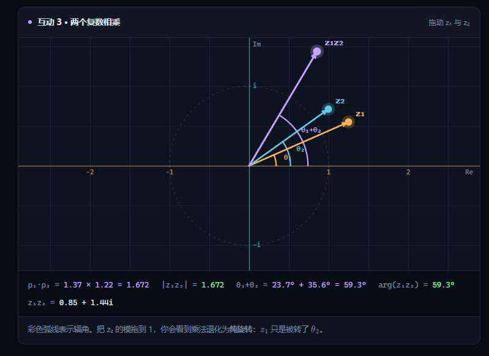
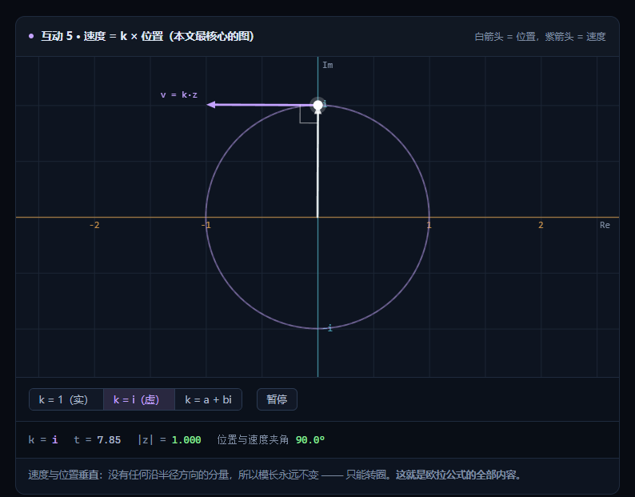
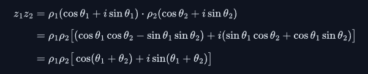

我需要一份HTML文档，讲解复数与旋转
整个文档贯穿了复数和旋转
我规定的章节目录
1. 讲解虚数单位i是什么，怎么来的
2. 讲解什么是复数，复数的几种表示方式代数形式$a + bi$，三角形式$r(\cos\theta + i\sin\theta)$，指数形式$r e^{i\theta}$
iθ，将欧拉公式讲解.html中这部分动态图形（下图image.png截图中的）加入，在其中加入表现出代数形式a,b，现在这个动态图的移动的元素e^(iθ)会超出画框，修复它

3. 讲解乘以i发生了什么，参考欧拉公式讲解.html中乘以i到底做了什么，加入这部分的动态图（image-1.png截图中的部分）

4. 讲解复数乘法：模相乘，角相加，参考欧拉公式讲解.html复数乘法：模相乘，角相加部分，其中的互动图(image-2.png部分)也加入，但是互动图的数轴刻度缩小至少显示到5
，要包含欧拉公式讲解.html这部分的两个复数相乘的公式
5. 讲解与旋转矩阵的关系，内容不应该像与旋转矩阵的关系：复数其实是一类矩阵这一部分那么冗长，应在保证理解的情况下保证必要理解信息，简洁明了，通俗易懂，尽可能的精炼
6. 讲解欧拉公式，包含欧拉公式的泰勒级数证明，根据e^(iθ)导数方向等根据e^x的性质等说明欧拉公式如何表示旋转，也要参考图(image-3.png)

7. 讲解e^(ipi)+1=0，
要求是整体内容要在保证理解的前提下尽可能的保留最核心的要点，简洁明了易于理解，要足够精炼，不要像欧拉公式讲解.html这个文件这样长篇大论，只保留最相关重要的东西，这个同时也要保证通俗易懂
参考动态图根据需要对其中的内容进行适当的修改以符合当前主题
HTML文档保持简约有设计感，给我单个HTML文件

1. 文档中的公式应该用数学公式渲染
2. 界面过于AI感，要符合数学的射击，逻辑严谨的风格
3. 我这个只是个笔记文档，将标题缩小到合适的大小，去掉下方的文字说明从 i² = −1 出发，把“这些和带箭头的那些
4. 互动1中也要表示出来cosθ和sinθ
5. 图中标签会始终留在画框内。这种说明下文字去掉
6. 在复数乘法中也加入这一部分
7. ；坐标轴显示到 ±5，这些说明性文字去掉
8. 互动2中的起点a和b滑动条去掉，也改成在图表中拖动
9. 05中让 z = x + yi 乘 a + bi，展开后实部是 ax − by，虚部是 bx + ay。写成矩阵就是：表述过于简单，尝试更易于理解
10. 泰勒级数证明参考这个

1. 任何线性变换，只要确定了“基向量”变到了哪里，这个变换就能被唯一确定，并且可以写成一个矩阵。是不是比矩阵只是把这两条坐标变换规则整齐地写在一起：这样更容易理解，如果是，尝试对这部分内容进行修订
2. 现在互动的背景表格绘制都有问题，尝试修复
3. 互动1中的初始状态下所有的文字都挤在了一起，尝试把黄色箭头拉长一点
4. 互动2中的Im和旁边的3i挤到一起了
5. 文档中引用格式的公式字体都太大了，缩小，保持美观
6. 把两个复数写成三角形式，展开乘积，再使用和角公式：中的公式中第二换换行了，希望不要换行
7. 互动3中的向量初始化状态也都挤在了一起，互动1和互动3的大小可以适当放大，要便于操作

1. 互动1中参考欧拉公式讲解.html动图 · 单位圆上中的Cos和sin如何绘制的，都有自己的向量箭头表示，且颜色一致，这样更容易区分
2. 互动1中的模r和角θ两个滑动条多余了去掉
3. 引用格式的数学公式的大小调大一下，太小了