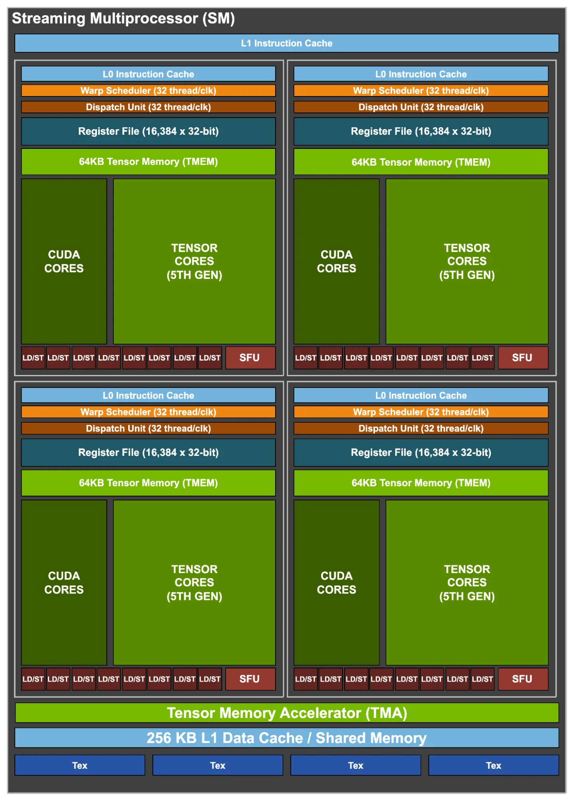

# Compute Shader 在 GPU 上是如何执行的

## ① 提交任务

```cpp
Dispatch(64,64,1) //CPU 运行时派发
[numthreads(8,8,1)] //Shader 编译期定义
```

得到：

* **4096 个 Thread Group**
* 每个 Group **64 Threads**
* 每个 Group = **2 Warp（32 Threads/Warp）**

> **GPU 调度的是 Group，而不是单个 Thread。**

---

## ② Group 被分配到 SM

GPU 的 GigaThread Engine 会不断把 Thread Group 分配给空闲的 SM。

```
4096 Groups
      │
      ▼
SM0  ← Group0
SM1  ← Group1
SM2  ← Group2
...
```

一个 SM 完成一个 Group 后，再领取下一个 Group。

---

## ③ Group 进入 SM

Group 被拆成多个 Warp。

```
64 Threads
      │
      ▼
Warp0 (32)
Warp1 (32)
```

> **Warp 是 SM 内部真正的调度单位。**

---

## ④ Warp 在 SM 内执行

```
Shader Program
      │
      ▼
L1 Instruction Cache
      │
L0 Instruction Cache
      │
Warp Scheduler
      │
Dispatch Unit
      │
 ┌────┼────┬────┐
 ▼    ▼    ▼
CUDA Tensor SFU
```

流程说明：

* **L1/L0 Instruction Cache**：缓存 Shader 指令
* **Warp Scheduler**：选择一个 Ready Warp
* **Dispatch Unit**：把指令发送到对应执行单元
* **CUDA / Tensor / SFU**：真正执行计算

---

## ⑤ 数据来自哪里

所有计算都会访问数据：

```
VRAM
   │
L2 Cache
   │
L1 Cache
   │
LD/ST
   │
Register File
   │
CUDA / Tensor / SFU
```

其中：

* **Register File**：线程变量（最快）
* **LD/ST**：负责所有 Load/Store
* **Tensor Memory**：Blackwell 新增，专门给 Tensor Core 提供矩阵数据

---

# 各模块一句话记忆

| 模块                   | 一句话                   |
| -------------------- | --------------------- |
| L1 Instruction Cache | 存整个 SM 的 Shader 指令    |
| L0 Instruction Cache | 存当前 Scheduler 即将执行的指令 |
| Warp Scheduler       | 每个 Clock 选择一个 Warp 执行 |
| Dispatch Unit        | 把 Warp 指令送到对应执行单元     |
| Register File        | 保存线程变量                |
| LD/ST                | 负责所有内存访问              |
| CUDA Core            | 普通算术运算                |
| Tensor Core          | AI 矩阵计算               |
| Tensor Memory        | Tensor Core 的高速数据缓存   |
| SFU                  | sin、cos、sqrt 等特殊数学函数  |

---

# 最重要的三个结论（90% 的人只需要记住这三个）

1. **Group 是 GPU 的调度单位，Warp 是 SM 的执行单位。**

2. **Warp Scheduler 每个 Clock（时钟周期）最多发射一个 Warp（32 Threads）的指令，因此常见写法 `32 thread/clk` 实际就是 `1 warp/clock`。**

3. **Shader 并不是一口气执行完，而是 Warp 在 SM 中不断经历“取指令 → 调度 → 发射 → 执行 → 等待内存 → 切换到其他 Warp”的循环，GPU 正是依靠这种 Warp 切换来隐藏显存访问延迟并保持高吞吐量。**

如果以后再看 NVIDIA 的 Ada 或 Blackwell SM 架构图，只需要沿着 **Instruction → Scheduler → Dispatch → Execution → Memory** 这条主线，就能快速理解每个模块的职责。

| 编号 | GPU模块                           | 所属阶段        | 核心作用                                 | 类比理解             | 典型处理内容                                                   |
| -- | ------------------------------- | ----------- | ------------------------------------ | ---------------- | -------------------------------------------------------- |
| 1  | **L1 Instruction Cache**        | 指令获取        | 存储整个 SM 最近使用的 Shader 指令              | CPU 的一级指令缓存      | CUDA / HLSL 编译后的机器指令，如 ADD、MUL、LOAD                      |
| 2  | **L0 Instruction Cache**        | 指令获取        | 每个 Warp Scheduler 前的小型高速指令缓存         | CPU 的微型指令缓存      | 保存当前马上要执行的几条 GPU 指令，减少访问 L1                              |
| 3  | **Warp Scheduler**              | 调度阶段        | 从多个 Warp 中选择下一周期执行哪个 Warp            | 任务调度员            | 选择 Ready Warp，隐藏 Memory Latency                          |
| 4  | **Dispatch Unit**               | 指令分发        | 将 Warp 指令发送到对应执行单元                   | 路由器              | ADD → CUDA Core；MMA → Tensor Core；sin → SFU；Load → LD/ST |
| 5  | **Register File**               | 数据存储        | 保存每个 Thread 的临时变量和计算结果               | CPU 寄存器堆         | float、int、中间计算结果、地址等                                     |
| 6  | **64KB Tensor Memory (TMEM)**   | Tensor 数据缓存 | Blackwell 新增，给 Tensor Core 使用的高速数据存储 | Tensor Core 专用缓存 | Matrix Tile、AI 推理矩阵数据、Accumulator                        |
| 7  | **CUDA Cores**                  | 通用计算        | 执行普通数学和逻辑运算                          | GPU ALU          | 加减乘除、FMA、比较、位运算                                          |
| 8  | **Tensor Cores (5th Gen)**      | AI矩阵计算      | 执行高速矩阵乘加运算                           | AI 专用计算器         | MMA：A×B+C，Transformer、DLSS、AI推理                          |
| 9  | **LD/ST Unit (Load/Store)**     | 内存访问        | 负责 GPU 与各种 Memory 之间的数据搬运            | 内存控制器接口          | Load Texture、读取 Buffer、写回 UAV、访问 Shared Memory           |
| 10 | **SFU (Special Function Unit)** | 特殊计算        | 执行复杂数学函数                             | 数学函数协处理器         | sin、cos、sqrt、rsqrt、exp、log                               |
