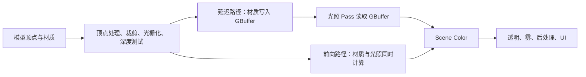

# UE5 延迟渲染与前向渲染：从原理到实际选择

先给出最重要的结论：

> 延迟渲染和前向渲染并不是两种不同的光照理论，而是两种不同的“组织光照计算的方法”。

它们都可能使用同样的 PBR 参数、BRDF、阴影贴图和光源。真正不同的是：

- 什么时候计算光照；
- 光照计算前保存什么数据；
- 如何找到影响某个像素的光源；
- 中间结果如何占用显存和带宽。

UE5 桌面端默认使用延迟渲染，因为它支持的功能最完整；前向渲染则更适合 VR、MSAA、光照较简单且追求较低基础开销的项目。[Epic：Forward Shading Renderer](https://dev.epicgames.com/documentation/unreal-engine/forward-shading-renderer-in-unreal-engine)

## 一、先从“一个像素最终是怎么变亮的”说起

一个表面像素最终的颜色，可以高度简化为：

```text
最终颜色
= 自发光
+ 间接光
+ Σ 每盏直接光的贡献
```

其中每盏光的贡献大致是：

```text
光照结果
= 光源颜色与强度
× 阴影可见性
× BRDF
× max(N · L, 0)
```

这里需要的信息包括：

- 像素的世界位置；
- 表面法线；
- Base Color；
- Metallic；
- Roughness；
- Specular；
- Shading Model；
- 观察方向；
- 光源方向、距离和衰减；
- 阴影结果。

前向与延迟渲染最终都要获得这些信息。区别在于：

- 前向渲染：绘制物体时，立刻使用材质和光源计算最终颜色。
- 延迟渲染：绘制物体时，先保存材质属性，等几何绘制完成后再统一计算光照。



注意，“延迟”不是把渲染推迟到下一帧，而只是把光照计算延迟到几何材质信息生成之后。

## 二、延迟渲染的原理

### 1. 核心思想：先看见表面，再给表面打光

延迟渲染通常分成两个核心阶段。

#### 第一阶段：几何和材质阶段

UE5 绘制不透明物体，运行顶点着色器和材质像素着色器。

但这时候不急着计算所有动态光照，而是把当前屏幕上最靠近摄像机的表面属性写入多张屏幕纹理。这些纹理合称为：

```text
GBuffer：Geometry Buffer，几何缓冲
```

典型信息包括：

- Base Color；
- 世界空间法线；
- Roughness；
- Metallic；
- Specular；
- Material AO；
- Shading Model ID；
- 深度；
- 速度信息；
- 某些着色模型的自定义数据。

具体哪些属性放在哪张纹理、使用多少位、是否独立保存，会随平台、功能和 UE 版本变化，因此不需要死记通道布局。UE 的 Buffer Visualization 可以直接观察 Base Color、World Normal、Roughness、Scene Depth 等数据。[Epic：Viewport Buffer Visualization](https://dev.epicgames.com/documentation/en-us/unreal-engine/viewport-modes-in-unreal-engine)

例如屏幕中央看到一个红色金属球，GBuffer 中对应位置可能近似保存：

```text
Base Color     = 红色
Metallic       = 1
Roughness      = 0.2
World Normal   = 球面该点的法线
Depth          = 该点到摄像机的深度
Shading Model  = Default Lit
```

这里保存的不是最终被灯照亮后的红色，而是“这个表面是什么”。

#### 第二阶段：光照阶段

几何绘制完成后，UE 再处理光源。

对于每盏灯，渲染器确定它在屏幕上影响的区域：

- 方向光可能影响全屏；
- 点光源通常对应一个球形范围；
- 聚光灯对应一个锥形范围；
- 很小的局部灯只影响少量屏幕像素。

光照着色器读取这些像素的深度、法线、Base Color、Roughness、Metallic 和 Shading Model，然后重建世界位置，执行 BRDF 和阴影计算，把该灯的贡献累加到 Scene Color。

所以延迟渲染的本质是：

```text
物体阶段：这个像素是什么材质？
光照阶段：哪些灯照到了这个像素？
```

### 2. 为什么延迟渲染适合大量动态光源

假设一个房间有：

- 100 种不同材质；
- 20 盏动态点光源；
- 许多灯光范围彼此重叠。

延迟渲染中，材质图主要在 Base Pass 中计算一次，生成 GBuffer。之后每盏灯读取统一格式的表面属性进行光照。

因此：

> 增加灯光通常会增加光照 Pass 的成本，但不会要求每个材质重新运行它完整的纹理采样和材质图。

可以把其成本粗略理解为：

```text
延迟成本
≈ 可见像素 × 材质/GBuffer 成本
+ Σ 每盏灯覆盖的屏幕像素 × 光照成本
+ GBuffer 读写带宽
```

这里有几个重要结论。

#### 光源不是免费的

如果一盏点光源只占屏幕一小块，它的成本较小。

如果几十盏灯的范围都覆盖整个屏幕，那么光照 Pass 仍然会非常昂贵。延迟渲染只是更善于处理多光源，不是让多光源失去成本。

#### 阴影可能比灯光本身更贵

为了得到阴影，渲染器通常需要从光源视角额外绘制场景，生成阴影深度数据。

所以一盏不投影的灯和一盏高分辨率、实时更新、投射阴影的灯，成本完全不是一个级别。

“延迟渲染擅长大量动态灯”主要指直接光照组织方式，并不意味着大量实时阴影也会便宜。

### 3. 延迟渲染的主要优势

#### 多动态光源下可扩展性更好

材质生成与光照计算分离，不需要把所有光照逻辑塞入每个不透明材质的主着色阶段。

#### 容易实现屏幕空间效果

屏幕上已经存在完整的深度、法线、粗糙度等信息，因此许多效果可以在几何完成后运行，例如：

- 屏幕空间反射；
- 屏幕空间环境光遮蔽；
- 接触阴影；
- 延迟贴花；
- 基于深度和法线的后处理。

#### UE5 高级功能支持更完整

根据当前 UE 5.8 桌面渲染路径支持表，Lumen、Nanite 和 Virtual Shadow Maps 均以桌面延迟路径为主要支持路径，桌面前向路径不支持这些功能。[Epic：Supported Features by Rendering Path](https://dev.epicgames.com/documentation/en-us/unreal-engine/supported-features-by-rendering-path-for-desktop-with-unreal-engine)

因此，如果项目高度依赖 Lumen 全动态 GI、Nanite、Virtual Shadow Maps 或完整的高端桌面渲染功能，通常应当从延迟渲染开始。

### 4. 延迟渲染的主要代价

#### GBuffer 消耗显存带宽

一个像素不只写一个最终颜色，还要写入多张纹理。随后光照阶段又要把这些纹理读回来，因此延迟渲染会产生大量 Render Target 写入、GBuffer 读取、显存带宽消耗和中间纹理占用。

#### MSAA 很不友好

MSAA 的核心是一个像素保存多个覆盖采样。

但延迟渲染不仅需要保存多个深度采样，还可能需要为采样保存不同的法线、材质属性、Shading Model 和光照结果。如果一个像素边缘的不同采样属于不同物体，就不能只保存一份 GBuffer 数据。

因此 UE 桌面延迟路径通常使用 TAA、TSR 或 FXAA，而不是 MSAA。

#### 透明物体无法自然写入普通 GBuffer

普通 GBuffer 基本上只保留一个像素最前面的表面。

但透明玻璃后面还可能有另一层玻璃、水面、粒子或不透明墙壁。透明渲染需要按一定顺序，把多层结果与背景混合。单份 GBuffer 无法表达“一个像素里有多层可见表面”。

理论上可以使用 A-Buffer、每像素链表等技术保存多层，但成本和复杂度很高。所以实时引擎通常对透明物体使用前向方式。

## 三、前向渲染的原理

### 1. 核心思想：绘制物体时直接完成光照

前向渲染中，一个物体进入像素着色器时，渲染器会：

1. 计算 Base Color、Normal、Roughness 等材质参数；
2. 找到影响该像素或物体的光源；
3. 计算每盏光的 BRDF、衰减和阴影；
4. 累加反射捕获、预计算光照等结果；
5. 直接输出最终 Scene Color。

所以前向渲染的逻辑是：

```text
这个像素是什么材质？
哪些灯影响它？
立刻把最终颜色算出来。
```

它不需要先写完整 GBuffer，再重新读取 GBuffer 计算光照。

### 2. UE5 前向渲染不是最原始的“每个物体遍历所有灯”

教材中最简单的前向渲染可能这样做：

```text
绘制物体
  遍历场景里的所有灯
    如果灯影响物体，计算光照
```

场景一旦有大量灯，这会产生大量无用计算。

UE5 的桌面前向渲染会先把光源和 Reflection Capture 剔除到一个视锥空间网格中。每个像素只遍历影响当前网格区域的光源列表。[Epic：Forward Renderer 的网格化光源剔除](https://dev.epicgames.com/documentation/unreal-engine/forward-shading-renderer-in-unreal-engine)

可以把它理解成 Forward+ 或 Clustered Forward 的思想：

```text
屏幕和深度方向划分成许多小区域
                ↓
判断每盏灯影响哪些区域
                ↓
每个区域生成自己的灯光列表
                ↓
像素只处理所在区域的相关灯光
```

例如场景里有 500 盏灯，但当前像素所在区域只有 4 盏灯，那么它只需要处理这 4 盏。

### 3. 前向渲染的成本模型

可以粗略表示为：

```text
前向成本
≈ 可见像素 × 材质计算
+ 可见像素 × 当前区域相关灯光数量
+ 光源分区/剔除成本
```

材质纹理通常不是为每盏灯重新采样一遍，而是先计算材质属性，然后在同一个组合着色器中遍历相关灯光。

但如果发生严重 Overdraw，例如大量三角形、透明层、粒子反复覆盖同一区域，那么“材质加光照”的组合着色器会被反复执行，成本可能很高。

### 4. 前向渲染为什么适合 MSAA

前向渲染直接生成最终颜色，不需要为每个采样保存一整套 GBuffer，再进行第二阶段光照。

在物体边缘处，渲染器可以根据 MSAA 覆盖情况保留多个颜色采样，最后解析成一个像素，因此前向路径更自然地支持 MSAA。

这对 VR 很重要：

- VR 头部运动会不断制造亚像素变化；
- TAA 的时间累积可能造成柔化、拖影或模糊；
- MSAA 画面通常更加稳定、清晰；
- 双眼视图又非常在意轮廓锯齿。

不过 MSAA 主要解决几何边缘锯齿，对高频法线和强烈高光导致的 Specular Aliasing 帮助有限。Epic 建议配合 Normal to Roughness、合理 LOD 和降低高频材质细节。Epic 的测试中，4× MSAA 相对 TAA 增加了约 25% GPU 帧时间，但实际值取决于项目内容。[Epic：Forward Shading 与 MSAA](https://dev.epicgames.com/documentation/unreal-engine/forward-shading-renderer-in-unreal-engine)

### 5. 前向渲染的优势

#### 不需要完整 GBuffer

减少大量 GBuffer 写入和读取，因此在某些场景中显存带宽压力更低、基础 Pass 更直接，GPU 帧时间也可能更低。

#### 适合 MSAA 和 VR

UE 前向路径支持 MSAA、Instanced Stereo，适合对清晰度和低延迟敏感的 VR 项目。

#### 功能可以按材质选择

UE 前向渲染中，一些高质量反射、平面反射等功能可以由具体材质选择是否启用。简单材质不必承担不需要的高质量功能，因此低复杂度内容可能获得较低的基础开销。

#### 透明物体更符合其天然工作方式

透明表面需要读取或看到背景、计算自身光照并按顺序与背景混合，这正是前向渲染擅长的流程。

### 6. 前向渲染的限制

#### 材质着色器更复杂

材质、光照、反射和阴影逻辑集中在同一个前向着色器中，会带来：

- 更大的着色器；
- 更多 Shader Permutation；
- 更长的编译时间；
- 更紧张的纹理采样器限制；
- 更高的寄存器压力。

#### 多灯重叠区域仍然昂贵

Forward+ 只排除不相关灯光。如果 30 盏灯确实同时照到一个像素，这个像素仍然需要计算大量灯光。分簇剔除不能消除真实的灯光重叠。

#### 缺少完整 GBuffer

依赖 GBuffer 的功能会受限。Epic 当前的前向渲染文档明确列出 SSR、SSAO、Contact Shadows 等屏幕空间技术的限制，并指出前向材质无法像延迟路径一样访问 GBuffer。[Epic：Forward Renderer 已知限制](https://dev.epicgames.com/documentation/unreal-engine/forward-shading-renderer-in-unreal-engine)

#### UE5 高端功能组合受限

当前桌面前向路径不支持 Lumen、Nanite、Virtual Shadow Maps；启用前向渲染时会使用传统 Shadow Maps，而不是 Virtual Shadow Maps。[Epic：Rendering Project Settings](https://dev.epicgames.com/documentation/unreal-engine/rendering-settings-in-the-unreal-engine-project-settings)

## 四、两者的核心对比

| 对比维度 | 延迟渲染 | 前向渲染 |
|---|---|---|
| 光照计算时机 | 几何和材质写完后统一计算 | 绘制物体时立即计算 |
| 中间数据 | 完整 GBuffer | 主要直接输出 Scene Color |
| 材质与光照 | 分离 | 集成在同一着色阶段 |
| 大量动态光源 | 通常更稳定、更擅长 | Forward+ 可缓解，但重叠灯仍昂贵 |
| 显存带宽 | GBuffer 读写较高 | 通常较低 |
| MSAA | 不适合 | 原生适合 |
| 透明表面 | 通常必须另走前向/透明路径 | 天然适合 |
| Overdraw | Base Pass 仍有成本，但光照延后 | Overdraw 会重复执行材质与光照 |
| 屏幕空间效果 | GBuffer 数据充足，较容易 | 缺少完整 GBuffer，限制更多 |
| Shader 复杂度 | 材质与光照相对解耦 | 材质和灯光逻辑集中 |
| UE5 高端功能 | Lumen、Nanite、VSM 主路径 | 当前桌面路径不支持这些组合 |
| 典型平台 | 高端 PC、主机、大型场景 | VR、MSAA、较简单光照项目 |

最容易产生的误解是：

> 前向渲染不一定更快，延迟渲染也不一定更慢。

真正决定结果的是：

- 分辨率；
- 材质复杂度；
- 光源数量和屏幕覆盖率；
- 阴影数量；
- Overdraw；
- 透明对象比例；
- 带宽；
- 是否使用 Lumen、Nanite、VSM；
- 目标 GPU 架构。

## 五、两者在 UE5 中如何配合

### 1. 延迟项目中的透明物体使用前向方式

这是最典型的混合方式。

假设场景包含墙壁、地面、金属桌子、玻璃窗和烟雾粒子，一帧可以近似这样工作：

```text
墙壁、地面、桌子
    ↓
写入 GBuffer
    ↓
延迟计算不透明物体光照
    ↓
得到已照明的背景 Scene Color
    ↓
玻璃、烟雾按透明顺序绘制
    ↓
使用前向或透明体积光照，与背景混合
    ↓
后处理
```

玻璃材质需要高质量逐像素本地灯光时，可以设置：

```text
Blend Mode：Translucent
Lighting Mode：Surface ForwardShading
```

此时，即使整个项目使用延迟渲染，这块玻璃仍然使用前向光照计算局部灯光和高光。[Epic：Per-Pixel Translucent Lighting](https://dev.epicgames.com/documentation/unreal-engine/lit-translucency-in-unreal-engine)

这就是：

> 延迟渲染负责大部分不透明表面，前向渲染负责难以写入单层 GBuffer 的透明表面。

### 2. “启用前向渲染”不代表整帧只剩一个 Pass

即使使用 Forward Shading，UE 仍可能执行：

- Depth Prepass；
- 阴影贴图 Pass；
- 光源分区；
- Base Pass；
- 透明 Pass；
- 雾和大气；
- 后处理；
- UI。

所以不能把前向渲染简单理解成“一次 Draw Call 完成整帧”。“前向”主要描述不透明表面的光照安排，而不是说整个渲染器只运行一次。

### 3. 阴影系统是两者共同依赖的前置数据

无论前向还是延迟，如果使用实时阴影，通常都需要先从光源方向生成阴影数据。

区别只是：

- 延迟路径在之后的 Lighting Pass 中采样阴影；
- 前向路径在材质与光照组合阶段采样阴影。

所以阴影贴图并不属于延迟渲染独有，也不属于前向渲染独有。

## 六、几个具体使用例子

### 例子一：大型写实开放世界

需求：

- 大量动态时间变化；
- Lumen GI；
- Nanite 场景；
- Virtual Shadow Maps；
- 屏幕空间和后处理效果；
- 大量材质和局部动态灯。

适合：

```text
桌面延迟渲染
```

原因不是“开放世界必然需要延迟”，而是当前 UE5 的核心高端功能组合主要建立在桌面延迟路径上。

### 例子二：VR 射击或 VR 驾驶舱

需求：

- 双眼高刷新率；
- 低延迟；
- 清晰稳定的边缘；
- 少量主要动态灯；
- 大量光照可以预计算；
- 可以接受没有 Lumen、Nanite、VSM。

适合：

```text
桌面前向渲染 + MSAA
```

这里的关键优势是 MSAA、Instanced Stereo、较低的基础渲染开销，以及简单内容可按材质关闭高质量反射等功能。

### 例子三：室内场景，大量会闪烁的动态灯

需求：

- 几十盏点光源；
- 警报灯、走廊灯、霓虹灯；
- 很多灯光区域重叠；
- 材质复杂；
- 不要求 MSAA。

通常优先：

```text
延迟渲染
```

但必须继续缩小灯光半径、减少投射阴影的灯、避免大量灯光覆盖全屏、控制阴影分辨率，并使用 Light Complexity 检查灯光重叠。

延迟渲染只能优化灯光组织方式，不能消除真实的灯光工作量。

### 例子四：延迟场景中的玻璃展示柜

场景的不透明墙壁和展品使用延迟渲染，玻璃使用：

```text
Translucent + Surface ForwardShading
```

最终顺序为：

```text
先完成不透明背景
→ 再计算玻璃的前向光照和反射
→ 将玻璃颜色与背景混合
```

这是两者在同一帧中配合的标准案例。

### 例子五：移动端项目

不要把“桌面前向/延迟”和“移动前向/移动延迟”完全混为一谈。移动端有独立、针对移动 GPU 优化的渲染路径。

当前 Epic 文档的建议大致是：

- 预计算光照为主：Mobile Forward 通常更合适；
- 动态光照复杂、使用 Tile-Based GPU：Mobile Deferred 可能更高效；
- 透明 Pass 即使在 Mobile Deferred 中仍使用前向方式。

[Epic：Mobile Rendering and Shading Modes](https://dev.epicgames.com/documentation/en-us/unreal-engine/mobile-rendering-and-shading-modes-for-unreal-engine)

移动延迟有时反而比移动前向更快，是因为很多移动 GPU 能把 GBuffer 保存在 Tile Memory 中，减少外部显存带宽。这说明：

> 渲染路径的性能不能只看理论 Pass 数量，还要结合 GPU 架构。

## 七、如何选择

### 优先选择延迟渲染，如果你需要

- Lumen；
- Nanite；
- Virtual Shadow Maps；
- 大量动态局部灯；
- 完整屏幕空间效果；
- 复杂写实材质；
- 高端 PC 或主机画质；
- 不需要 MSAA。

### 优先测试前向渲染，如果你需要

- VR；
- MSAA；
- 极低延迟；
- 光源较少；
- 大量光照已经烘焙；
- 材质可以主动选择较低成本功能；
- 不依赖 Lumen、Nanite 和 VSM；
- 目标项目已经明确验证了前向路径的功能支持。

注意这里是“优先测试”，不是不经测试就认定更快。

## 八、在 UE5 中如何真正观察它们

只看概念很容易停留在模糊认识，建议亲自做下面几个实验。

### 1. 查看 GBuffer

在延迟项目中打开：

```text
View Mode → Buffer Visualization → Overview
```

分别观察：

- Base Color；
- World Normal；
- Roughness；
- Metallic；
- Scene Depth；
- Shading Model。

你会直观看到延迟渲染在光照前到底保存了什么。

### 2. 查看灯光重叠

使用：

```text
viewmode lightcomplexity
```

它会显示非静态灯光对表面的重叠数量。大量红色、粉色、白色区域通常意味着光源重叠严重。[Epic：Light Complexity](https://dev.epicgames.com/documentation/en-us/unreal-engine/viewport-modes-in-unreal-engine)

### 3. 查看材质和透明 Overdraw

使用 Shader Complexity、Quad Overdraw 等视图，重点检查：

- 粒子；
- 草木；
- 多层玻璃；
- 半透明 UI；
- 大面积透明特效。

前向渲染中，Overdraw 会反复执行材质与光照组合着色器，因此尤其值得关注。

### 4. 比较实际 GPU Pass

使用：

```text
ProfileGPU
```

或按：

```text
Ctrl + Shift + ;
```

重点观察：

- PrePass；
- BasePass；
- ShadowDepths；
- DeferredLighting；
- Translucency；
- PostProcessing。

也可以使用 RenderDoc 捕获一帧，直接查看 GBuffer、灯光 Pass 和透明 Pass 的顺序。[Epic：Graphics Programming Overview](https://dev.epicgames.com/documentation/unreal-engine/graphics-programming-overview-for-unreal-engine)

## 九、最终应该建立的认知

把延迟渲染记成：

> 先把屏幕上可见的不透明表面压缩成一套材质数据库，也就是 GBuffer；然后让光源查询这个数据库并累加光照。

把前向渲染记成：

> 绘制表面时，直接取得当前区域相关的灯光，完成材质、光照和反射计算，然后输出最终颜色。

两者的本质关系是：

- 使用的光照理论可以相同；
- 使用的材质参数可以相同；
- 都需要可见性判断和阴影数据；
- 差别主要是数据布局与计算调度；
- 延迟路径通常更偏向功能丰富和复杂动态光照；
- 前向路径通常更偏向低基础开销、MSAA 和 VR；
- 实际 UE5 帧经常是混合管线，而不是绝对纯粹的一种；
- 最典型的混合就是“不透明物体延迟，透明物体前向”。

如果只记住一句话：

> 延迟渲染保存“表面是什么”，之后再问“灯怎样照它”；前向渲染在看见表面的当下，立即把“材质是什么”和“灯怎样照它”一起算完。
